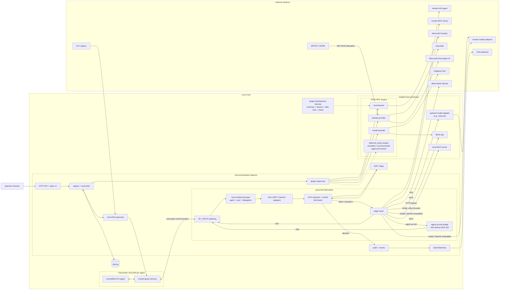

# microorchestrator Specification

Status: draft v0.1

## 1. Purpose

microorchestrator is a small, single-host control plane for running isolated AI
agents without Kubernetes. It manages agents, MCP tools, model endpoints, policy,
and integrations from one local web UI and API.

The product is open-source and standards-first. Vendor-specific behavior lives
only in out-of-process plugins.

## 2. Design rules

1. One host daemon, one SQLite database, one web UI.
2. One Firecracker microVM per running agent.
3. Agent artifacts are unmodified OCI images.
4. Agent communication uses A2A; tool communication uses MCP; model communication
   uses OpenAI-compatible APIs.
5. Every A2A, MCP, and model request crosses a fail-closed policy enforcement
   point.
6. Agent microVMs have no general-purpose network interface in v0.1.
7. Vendor SDKs and vendor resource types are forbidden in the core.
8. Add an abstraction only at an actual replacement boundary: plugins, policy
   engines, and artifact/runtime protocols.
9. Prefer deletion, operating-system facilities, and existing open-source
   components over new framework code.

## 3. Scope

### 3.1 v0.1

- Linux x86_64 host with KVM.
- Local, single-operator installation.
- Create, update, start, stop, and delete agents.
- Run each agent in a Firecracker microVM with explicit CPU, memory, disk, and
  lifetime limits.
- Register remote MCP servers and install local MCP server artifacts.
- Register remote models and install Hugging Face models for local serving.
- Route every model request through the host model gateway.
- Publish and consume A2A agent cards.
- Create explicit agent-to-agent, agent-to-tool, and agent-to-model edges.
- Attach policy to global, agent, and edge scopes.
- Evaluate policy before every logical interaction.
- Import from and export to third-party agent environments through plugins.
- Stream logs, lifecycle events, policy decisions, and usage to the UI.
- Emit OpenTelemetry.

### 3.2 Non-goals for v0.1

- Kubernetes support.
- Multi-host scheduling, clustering, high availability, or federation.
- A general cloud control plane.
- Training or fine-tuning models.
- A proprietary agent framework.
- Arbitrary guest internet access.
- Transparent inspection of private in-process function calls.
- Replacing Firecracker, OPA, MCP, A2A, or the OpenAI-compatible model contract
  with custom equivalents.
- A plugin SDK for every possible future extension.

## 4. System boundary



The control plane and data plane are logical modules in one daemon for v0.1.
They may be split only after measured load or availability requirements justify
another process.

Solid arrows are runtime or control paths. Dotted arrows are development-time
or deferred extension paths. The microVM has no network interface; every
network-visible agent interaction crosses the vsock gateway and policy path.

## 5. Host requirements

- Linux x86_64.
- Read/write access to `/dev/kvm`.
- Firecracker and its jailer from a pinned, verified release.
- cgroup v2, namespaces, seccomp, and nftables available.
- Enough local storage for immutable guest images, OCI artifacts, and model
  weights.
- GPU support is optional. CPU-only local inference must remain possible.

macOS and Windows may operate a remote Linux host, but are not execution hosts
in v0.1.

## 6. Core resources

All resources have a stable ID, display name, revision, labels, creation time,
update time, and desired/current status.

### 6.1 Agent

An Agent contains:

- OCI image reference and immutable digest.
- command and arguments, when the image does not provide them.
- environment variable names and non-secret values.
- references to secrets; never secret values in resource JSON.
- CPU, memory, disk, timeout, and restart limits.
- protocol endpoint: Responses API and/or A2A.
- declarative A2A agent card.
- allowed outbound peer, tool, and model edges.
- policy references.
- optional external-environment mappings supplied by plugins.

Agent code is not required to import a microorchestrator or governance SDK.

### 6.2 Tool

A Tool is an MCP server:

- remote HTTPS endpoint; or
- local OCI artifact managed as an isolated workload.

Its descriptor records transport, capabilities, input schema, trust metadata,
secret references, health, and policy labels. MCP is the only tool protocol in
v0.1.

Private functions embedded in an agent process are outside the platform's
observable policy boundary. To be governed, a tool must be exposed through MCP
or the agent must voluntarily integrate a runtime policy adapter.

### 6.3 Model

A Model is a stable public name routed by the host model gateway to:

- a remote OpenAI-compatible/provider endpoint registered by a plugin; or
- a local model server installed by a model plugin.

The host model gateway is the single OpenAI-compatible endpoint. OpenAI-compatible
backends need no adapter. A non-OpenAI-native provider is adapted by an optional
model adapter (for example LiteLLM) owned by its `model-provider` plugin, not by
a mandatory platform process. No component executes model weights except the
model server itself.

The default local plugin downloads a pinned Hugging Face artifact and starts a
llama.cpp OpenAI-compatible server. Other runners, such as vLLM, are optional
future plugins.

Model records include source, immutable revision, license metadata, artifact
hash, runtime, capabilities, context size, health, and policy labels.

### 6.4 Edge

An Edge is an explicit permitted relationship:

```text
agent -> agent
agent -> tool
agent -> model
agent -> egress destination
```

An edge identifies source, target, allowed operation or skill, policy
references, and optional limits. An egress edge names an allowed outbound
destination (host and port or URL prefix) for the harness proxy. Creating an
edge does not permanently authorize traffic; every runtime interaction is
evaluated again.

### 6.5 Policy

A Policy is a versioned policy bundle plus bindings to intervention points and
resource scopes. Policies compose in this order:

```text
global + resource + edge
```

Composition may narrow permission but must never broaden a parent policy.

## 7. Agent packaging and execution

### 7.1 Artifact contract

- OCI Image Specification is the transport and integrity format.
- Images are resolved to a digest before execution.
- The operator materializes the OCI root filesystem as a read-only workload
  disk; writable state uses a disposable overlay or explicit persistent volume.
- The trusted guest image is separate from the workload artifact.

The exact OCI-to-Firecracker materialization mechanism is an implementation
decision that must be proven by the first technical spike.

### 7.2 Trusted guest harness

The base guest contains a minimal init/harness outside the agent artifact. It:

- starts the agent as an unprivileged user;
- applies process and filesystem limits;
- exposes loopback protocol endpoints expected by the agent;
- exposes a loopback HTTP(S) forward proxy and injects `HTTP_PROXY`,
  `HTTPS_PROXY`, and `NO_PROXY` so standard clients route outbound HTTP through
  the governed egress path;
- injects standard endpoint variables and a short-lived host-issued local
  credential;
- proxies approved traffic over Firecracker `vsock`;
- forwards health, logs, usage, and shutdown events;
- never contains provider-specific behavior.

The workload cannot modify the read-only harness or guest base image.

### 7.3 Zero-code compatibility contract

Zero-code means no microorchestrator library is linked into the agent. It does
not mean any arbitrary binary can be governed semantically.

An agent is compatible when it:

- listens on a declared Responses API or A2A port;
- uses injected OpenAI-compatible base URLs for model calls;
- uses injected MCP endpoints for tool calls;
- uses discovered A2A card URLs for peer calls;
- routes other outbound HTTP(S) through the injected proxy variables rather than
  opening raw sockets.

Agents that honor standard proxy environment variables reach allow-listed
destinations through the governed egress path; a hard-coded URL is a policy
decision, not an automatic failure. The guest still has no network interface, so
raw sockets and proxy-ignoring clients fail. The harness reports failed direct
egress as a best-effort incompatibility signal and must not claim to identify
every incompatible code path.

## 8. Communication

### 8.1 Principle

Agents communicate directly at the protocol level, but never directly at the
network level:

```text
Agent A
  -> guest harness
  -> vsock
  -> host gateway
  -> vsock
  -> Agent B guest harness
  -> Agent B
```

The operator configures registry, routing, identity, and policy. Its control
API is not called as part of an A2A conversation. In v0.1 the host gateway is
a module in the same daemon, but has a separate internal interface and bounded
queues.

The **host gateway** is the single mediation point every governed interaction
crosses: it authenticates the source, evaluates policy through the governance
middleware (§8.7), routes to the target backend, governs egress, and audits.

### 8.2 A2A

- Each enabled agent publishes an A2A agent card.
- The host registry is authoritative for local cards.
- External cards are imported explicitly through a plugin or trusted URL.
- Discovery returns metadata only; it does not grant trust.
- The caller chooses a configured peer and sends standard A2A messages.
- The host gateway authenticates the source from its assigned VM identity,
  evaluates policy, forwards the request, and preserves W3C trace context.
- Both synchronous and streaming A2A calls are supported.
- Delegation depth and caller chain are carried as signed host metadata and
  cannot be supplied or increased by the workload.

Do not build broadcast discovery, semantic routing, or a full mesh in v0.1.
Explicit peer edges and stable skill IDs are sufficient.

### 8.3 MCP

- Agents receive only MCP servers attached by explicit edges.
- MCP requests pass through the host gateway.
- Policy sees caller, server, tool name, sanitized arguments metadata, labels,
  delegation context, and current limits.
- Tool results return through the same path for optional result labeling or
  transformation.
- Local MCP servers do not share an agent microVM.

### 8.4 Models

- Agents call a loopback OpenAI-compatible endpoint exposed by the harness.
- The host evaluates `pre_model_call` policy and resolves the stable model name
  to a local or remote backend.
- OpenAI-compatible backends are called directly. A non-OpenAI-native provider
  is reached through the optional model adapter of its `model-provider` plugin.
- The response crosses an optional `post_model_call` policy before returning.
- Streaming is authorized once before opening the stream. Individual tokens are
  not separately authorized.
- A retry is a new interaction and receives a new policy decision.

### 8.5 Egress

- The harness exposes a loopback HTTP(S) forward proxy and injects
  `HTTP_PROXY`, `HTTPS_PROXY`, and `NO_PROXY`.
- Outbound HTTP(S) crosses vsock to the host gateway and is evaluated against
  egress edges before any external connection.
- Egress is default-deny. Only destinations named by an egress edge are allowed.
- The proxy governs HTTP(S) by destination; it does not open a general network
  path. Raw sockets and proxy-ignoring clients still cannot reach the network.
- Allowed egress is audited with source identity, destination, and trace ID.

### 8.6 Network enforcement

Agent microVMs have no TAP/NIC in v0.1. `vsock` is the only host communication
channel. Each VM receives a dedicated host-side vsock Unix socket and
Firecracker instance handle. The host exposes only protocol gateway operations
on that channel.

If a future feature adds guest networking, it must be default-deny and enforced
with a per-VM network namespace and nftables. Firecracker itself does not filter
guest egress.

### 8.7 Protocol governance middleware

A single host middleware pipeline wraps every A2A, MCP, and model route:

```text
request
  -> derive source from the accepted per-VM vsock socket and instance handle
  -> resolve target and active edge
  -> build ACS snapshot
  -> evaluate pre-interaction policy
  -> deny, warn, escalate, transform, or dispatch
  -> protocol handler
  -> evaluate configured post-interaction policy
  -> audit and return
```

Thin protocol adapters extract typed facts without hiding the original payload:

- A2A: peer, skill, task, delegation chain, and streaming mode.
- MCP: server, tool name, arguments, and result labels.
- Model: stable model name, operation, requested tokens, tools, and streaming
  mode.

The middleware is part of the trusted host daemon, not agent code. The guest
harness transports requests but does not make authorization decisions. The
vsock CID is routing metadata, not proof of identity, and may be reused only
after the previous instance and socket are gone.

Route registration without this middleware is forbidden. Tests must prove that
each protocol's allowed request reaches its upstream and denied request does
not.

## 9. Identity and secrets

- The host assigns an unforgeable runtime identity to each microVM and binds it
  to the dedicated vsock socket, Firecracker process/instance handle, agent
  revision, and process lifetime. CID is only a routing label.
- Local A2A authorization uses that host identity.
- External identity is supplied by `identity-provider` plugins using OAuth
  2.0/OIDC where available.
- The core principal is provider-neutral: local agent ID and revision, optional
  verified human subject, actor/delegation chain, issuer, audience, scopes, and
  expiry.
- Identity plugins may validate credentials, map external identities, and
  acquire or exchange audience-scoped credentials. They do not make
  authorization decisions; OPA evaluates the normalized principal.
- Workload identity may be federated from a SPIFFE JWT-SVID. SPIFFE/SPIRE,
  Keycloak, and Entra are optional profiles; the local runtime does not require
  them.
- Provider credentials are held by the host or provider plugin and are never
  injected into agent workloads when a gateway can make the call.
- Secret values are excluded from SQLite, API responses, events, and logs.
- v0.1 stores local operator secrets in a daemon-owned `0600` file outside the
  database. Pluggable secret stores are deferred until a second store is
  required.

## 10. Governance

### 10.1 Required behavior

Every logical input, A2A call, MCP call, model call, and output that crosses the
platform boundary receives a policy decision immediately before execution.
Policy failure, timeout, malformed output, or missing context denies the action.

Runtime decisions are distinct from edge admission:

1. Admission policy decides whether an operator may create the edge.
2. Runtime policy decides whether the current interaction may use it.

### 10.2 Policy contract

The default governance integration implements the open-source Agent Governance
Toolkit Agent Control Specification (ACS) decision shape with OPA/Rego.

Supported intervention points:

- `agent_startup`
- `input`
- `pre_model_call`
- `post_model_call`
- `pre_tool_call`
- `post_tool_call`
- `output`
- `agent_shutdown`

Supported normalized verdicts:

- `allow`
- `warn`
- `deny`
- `escalate`
- `transform`

The core sends a complete JSON snapshot and acts on the verdict. OPA remains
stateless. Budgets, rate windows, approvals, and collective limits are host
state included in the snapshot.

### 10.3 Policy inputs

Use verified metadata, not untrusted workload claims:

- source identity and revision;
- acting user, when externally verified;
- target identity and revision;
- protocol, operation, A2A skill, MCP tool, or model name;
- edge and policy revisions;
- cluster/host mode;
- delegation chain and depth;
- data labels and destination clearance;
- requested token, time, and resource limits;
- stateful counters supplied by the host.

Full prompts, files, tool results, and model output are excluded unless a bound
policy explicitly requires content classification.

### 10.4 Annotators

Policies may request a classifier, model, or HTTP annotator. Annotators produce
labels; they do not authorize. Rego makes the final decision.

Annotator model calls also pass through the host gateway under a
dedicated system identity to prevent recursive unbounded evaluation.

### 10.5 Initial policy families

- Edge allow/deny by source, target, operation, and mode.
- Capability and skill restrictions.
- Model entitlement and data-residency labels.
- MCP tool and argument restrictions.
- Delegation depth and monotonic scope narrowing.
- Per-call token and duration ceilings.
- Human approval through `escalate`.
- Warning-only shadow rollout.
- Request transformation for bounded redaction or limit reduction.

Information-flow labels, sliding-window budgets, trust history, collective mesh
policies, and kill switches use host state and arrive after the stateless
enforcement path works.

### 10.6 Unavoidable enforcement

- The guest has no general network path around the harness and host gateway.
- Local model servers, any optional model adapter, local MCP servers, and
  plugins run in dedicated host network namespaces. Their routes accept traffic
  only from the host gateway; they cannot reach the operator API.
- Local agent endpoints are reachable only through their harness/vsock route.
- Provider plugins never return raw credentials to workloads.

## 11. Plugins

### 11.1 Boundary

Plugins are out-of-process executables. A crash, dependency conflict, or vendor
SDK cannot crash or contaminate the core daemon.

Plugins communicate over JSON-RPC 2.0 on stdin/stdout and publish a small JSON
manifest containing:

- protocol version;
- plugin ID and version;
- declared capabilities;
- configuration JSON Schema;
- required host permissions;
- health operation.

The core supports only capabilities required by v0.1:

- `environment`: list, inspect, import, and map external agents, tools, and
  models;
- `model-provider`: search, resolve, download, verify, remove, start, stop,
  inspect, and health-check local models;
- `identity-provider`: validate an external token, map its subject to a core
  principal, and acquire or exchange an audience-scoped credential for a
  configured target.

The project ships a language-neutral plugin development harness:

- versioned manifest, request, response, and error JSON Schemas;
- a local fake host that performs initialization and invokes declared methods;
- `microorchestrator plugin check <executable>` for handshake, health,
  capability, timeout, size-limit, and malformed-response conformance;
- minimal request/response fixtures for each shipped capability.

The runtime host owns process launch, initialization, supervision, deadlines,
logging, cancellation, permission grants, and opaque handles. A plugin
implements only its declared capability methods.

Do not create language-specific plugin SDKs in v0.1. Add a thin SDK only after
two maintained plugins in that language repeat the same protocol plumbing. The
schemas remain authoritative.

### 11.2 Extension selection

Use an existing open protocol as the extension boundary when it already fits:

- MCP servers extend tools.
- A2A cards and skills extend agent discovery and invocation.
- OCI registries extend artifact distribution.
- OpenAI-compatible endpoints extend model serving.
- OpenTelemetry exporters extend telemetry destinations.

Agent-as-tool is one built-in bridge that publishes an allowed A2A skill as an
MCP tool and preserves the real caller, target agent, skill, and delegation
chain for policy. It does not need a plugin capability until a second protocol
bridge exists.

The following plugin capabilities are deferred until a concrete second
implementation requires each contract:

- `policy-engine`: evaluate the fixed ACS snapshot and verdict contract; the
  core still applies verdicts and fails closed.
- `annotator`: add classifier or DLP labels to a policy snapshot; it cannot
  authorize.
- `secret-provider`: resolve opaque secret handles without exposing storage
  details to the core or workloads.
- `approval-channel`: deliver and receive approval messages; approval state,
  expiry, and final enforcement remain in the core.

Plugins translate or enrich. The following remain nonpluggable because they
define the platform's security and consistency boundary:

- Firecracker isolation and VM identity binding;
- resource graph, edge model, and lifecycle state machine;
- shared governance middleware and authorization enforcement;
- audit record and SQLite transaction ownership.

Do not add UI plugins, arbitrary lifecycle hooks, storage-engine plugins, or
middleware chains.

### 11.3 Plugin isolation

- Plugins run as dedicated unprivileged host processes in isolated network
  namespaces.
- Capabilities and filesystem/network permissions are declared and approved.
- Inputs and outputs are size- and time-bounded.
- A plugin cannot access the SQLite file directly.
- Secret access is by opaque handle and only when declared.
- Identity plugins return credentials only to the host protocol gateway, never
  to a guest workload or another plugin.
- Plugin operations produce audit events.

### 11.4 First-party plugins

- `huggingface-llamacpp`: resolve and download a pinned Hugging Face model,
  verify hashes and license metadata, and manage a llama.cpp server.
- `foundry`: map Microsoft Foundry agents, model deployments, and connections
  to core resources without adding Foundry types to the core.
- `keycloak`: provide operator OIDC, workload client authentication, and RFC
  8693 token exchange.
- `entra-agent-id`: provision and map Agent ID blueprints and identities and
  use the Microsoft Entra ID Auth SDK sidecar for autonomous, agent-user, and
  user OBO flows.

These plugins are optional. The core must build, test, and run without them.
Keycloak and Entra may accept a SPIFFE JWT-SVID as a federated workload
credential when configured; SPIRE is not required by the core.

## 12. Model gateway and optional adapters

The host gateway is the single OpenAI-compatible model endpoint. It owns stable
model names, backend resolution, `pre_model_call`/`post_model_call` policy,
usage accounting, and audit. microorchestrator does not run a second model proxy
in the required path.

OpenAI-compatible backends (llama.cpp and OpenAI-compatible remote endpoints)
are called directly. A non-OpenAI-native provider (for example Anthropic
Messages, Bedrock, or Vertex) is adapted by an optional model adapter owned by
its `model-provider` plugin. LiteLLM is one such adapter, used only inside a
plugin when native-API translation is required; it is not a core process and
does not require PostgreSQL.

Backend credentials stay with the host or the provider plugin. Workload
authorization is performed by the host gateway using the verified microVM
identity.

## 13. Operator API and UI

### 13.1 API

The daemon exposes a versioned HTTP/JSON API and Server-Sent Events for status.
The API is described by OpenAPI.

Resource operations are asynchronous when they start downloads, plugins,
models, or microVMs. They return an operation ID with explicit pending,
running, succeeded, failed, and cancelled states.

### 13.2 UI

The UI is served by the daemon and provides:

- dashboard: host capacity, running workloads, denied interactions, model use;
- agents: create from OCI, lifecycle, limits, card, logs, attached edges;
- tools: register/install MCP servers, inspect schemas, health, attach edges;
- models: register remote models or install a Hugging Face model, progress,
  health, remove;
- graph: create and remove agent/peer/tool/model edges;
- policies: select bundles, edit safe parameters, shadow/enforce mode, decision
  history;
- plugins: install, enable, configure, update, disable;
- operations: progress and failure details.

The UI does not offer arbitrary Rego editing in v0.1. Policy authors manage
versioned bundles as files; operators edit validated parameters.

Use server-rendered HTML plus small ES modules and native browser APIs. Adopt a
SPA framework only if the graph editor proves it necessary.

## 14. Reconciliation and failure behavior

- SQLite records desired and observed state.
- One bounded reconciliation loop converges resources after startup or change.
- Operations are idempotent and safe to retry.
- The daemon adopts only processes and microVMs carrying its instance marker.
- Startup reconciliation detects and reports orphaned processes, mounts,
  sockets, CIDs, and artifacts.
- Destructive cleanup targets exact resource IDs and paths.
- Policy denial is a normal result, not an infrastructure failure.
- Policy engine unavailability fails closed for new interactions; active
  streams finish under the decision that opened them.
- Agent crash restart follows an explicit finite policy; no infinite restart
  loop.

## 15. Observability

- OpenTelemetry traces, metrics, and logs.
- W3C trace context preserved across A2A, MCP, model, plugin, and harness hops.
- Every policy decision records timestamp, source, target, operation, policy
  digest, verdict, reason, latency, and trace ID.
- Never record bearer tokens, provider credentials, full prompts, or tool
  payloads by default.
- Local structured logs work without an external collector.

## 16. Security baseline

- Firecracker always starts through the jailer.
- One unprivileged UID/GID and cgroup subtree per microVM.
- Pinned guest kernel, base rootfs, Firecracker, plugin, and OCI digests.
- Read-only base and workload disks; explicit writable overlays.
- No agent guest NIC in v0.1.
- No host filesystem mounts into agents.
- Bounded serial/log output.
- Bounded CPU, memory, disk, file descriptors, processes, runtime, and request
  sizes.
- Host APIs bind to loopback by default.
- The control API is authenticated with a random bootstrap token stored in a
  daemon-owned `0600` file. The browser exchanges it once for an HttpOnly,
  SameSite=Strict session cookie. Plugins receive neither token nor cookie.
- CSRF protection and origin checks cover browser mutations.
- Destructive UI operations require explicit confirmation.
- Policy and plugin updates are audited and reversible.

MicroVM isolation contains workloads; it does not protect a compromised host.

## 17. Open standards and open source

Core contracts:

- OCI Image and Distribution specifications: agent/tool artifacts.
- A2A: agent cards, messages, streaming, and tasks.
- MCP: tool discovery and invocation.
- OpenAI-compatible APIs, including Responses where supported: model traffic.
- OpenAPI: operator API.
- JSON-RPC 2.0 and JSON Schema: plugin protocol.
- OAuth 2.0 and OpenID Connect: external identity.
- OPA/Rego and ACS-compatible snapshots/verdicts: governance.
- OpenTelemetry and W3C Trace Context: telemetry.
- SPDX license identifiers and OCI digests: artifact metadata.

All required runtime components must use OSI-approved licenses compatible with
project distribution. A dependency inventory and license check are release
gates.

## 18. Data storage

SQLite is the only core database in v0.1. It stores resources, revisions,
operations, desired/observed state, counters, and audit indexes.

Large artifacts, model weights, VM disks, logs, and policy bundles live in a
content-addressed data directory and are referenced by digest. SQLite stores no
large blobs and no secret values.

## 19. Acceptance criteria

v0.1 is complete when:

1. A clean Linux host passes a prerequisite check for KVM and required kernel
   features.
2. The daemon and UI install without Kubernetes.
3. An unmodified compatible OCI agent starts in a jailed Firecracker microVM.
4. The agent cannot reach an arbitrary internet address.
5. The UI installs one pinned Hugging Face model and serves it through
   llama.cpp under a stable model name.
6. The same agent can call a registered remote model without changing its
   image.
7. Two agents discover cards and exchange streaming A2A messages.
8. An agent invokes an attached MCP tool.
9. Allow, deny, warn, escalate, and transform decisions are demonstrated.
10. Removing an edge immediately prevents the next interaction.
11. A denied model, MCP, or A2A request cannot bypass the host gateway.
12. A conformance test proves every A2A, MCP, and model route is registered
    through the governance middleware.
13. Restarting the daemon reconciles running resources without duplicating
    them.
14. A minimal external-environment plugin passes conformance tests.
15. The optional Foundry plugin lists and maps at least one external resource.
16. One trace connects agent input, policy decisions, A2A/MCP/model calls, and
    output.

## 20. Deferred decisions

The implementation plan must validate these before committing:

- OCI image materialization into a Firecracker workload disk.
- Reliable host-to-guest and guest-to-host streaming over vsock.
- Whether any non-OpenAI-native provider adapter is needed before v0.1 ships.
- llama.cpp model format selection and safe Hugging Face license acceptance.
- ACS/AGT version stability; it is currently public preview and ACS is draft.
- Approval persistence and recovery semantics.
- GPU device access from the local model runner; model runners stay outside
  agent microVMs in v0.1.

## 21. References

- Firecracker: <https://github.com/firecracker-microvm/firecracker>
- Firecracker production host setup:
  <https://github.com/firecracker-microvm/firecracker/blob/main/docs/prod-host-setup.md>
- LiteLLM: <https://github.com/BerriAI/litellm>
- Model Context Protocol: <https://modelcontextprotocol.io/>
- A2A Protocol: <https://a2a-protocol.org/>
- Open Policy Agent: <https://www.openpolicyagent.org/>
- Agent Governance Toolkit:
  <https://github.com/microsoft/agent-governance-toolkit>
- OpenTelemetry: <https://opentelemetry.io/>
- OCI specifications: <https://opencontainers.org/>
